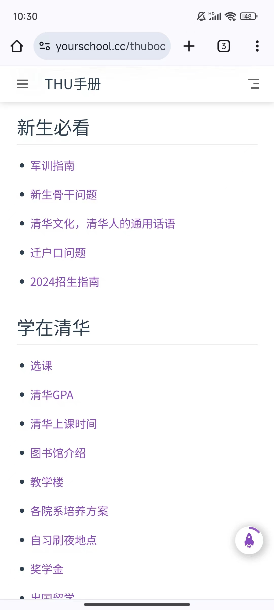
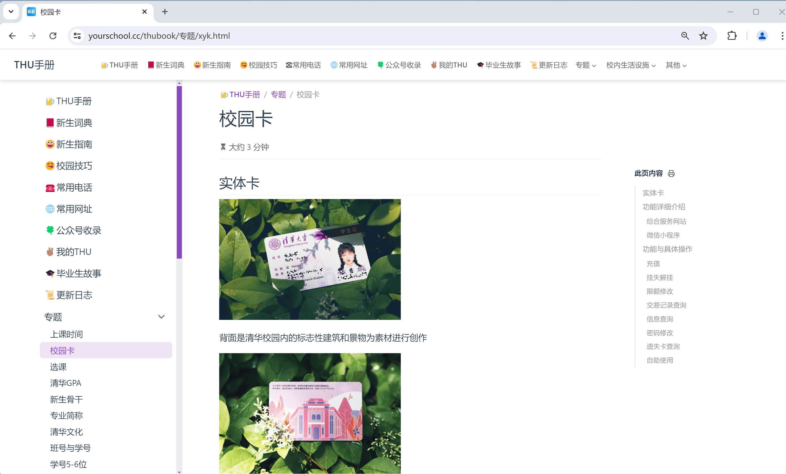

# 🍺THU手册

欢迎使用[THU手册!](#🍺THU手册)

这是一份关于清华校内生活，学习方面的百科全书

我们尽可能的收集各种实用信息和数据，让这本手册成为你大学之路上消除信息差的利器！

## 2025新生群群号

本来写在[新生指南](./newstudent.md)那一篇，但是发现很多人还是没找到，所以直接搬到这里。

793410424

欢迎五字班同学进群！

## 关于

本手册的所有内容均来自公开信息

本手册由自动化系，计算机系七字班同学编写和部署第一版

本手册由所有愿意参与维护的清华同学共同维护和补充

## 访问本手册

### 网页访问

可以在网页端输入<https://yourschool.cc/thubook>来访问本手册。

本手册支持手机，平板，电脑屏幕自适应。

​	

## 我是新生

我们制作了本手册的目录索引[新生指南](./newstudent.md)，方便新生更好的查阅

## 成为贡献者

如果你有想分享的信息，或是发现了本手册的错误，或是发现了过时的信息需要更新，欢迎贡献和指正，一起让这份手册越来越完善，对大家越来越有用！

所有的贡献者，我们采用班号实名，姓名随意的原则，保证本手册的所有编写者，均为清华同学。

欢迎加入thubook开发维护q群：967858624

## 关于开源

我们会在合适的时间将本手册的全部源代码，文档，图片资源开源。

但是目前开源并不能更好的让本手册得到维护，所以我们选择通过[维护群](#成为贡献者)的方式快捷维护。

## 所有贡献者列表

电41花青，生31秋，自43琪，生42冬天的雨，航11赤舟，经05易文卓，软3 eric，计科23 evel，计37陈筱涵，法32于大虾，数41施计芸，计76林慎吾，自76张广昱  

