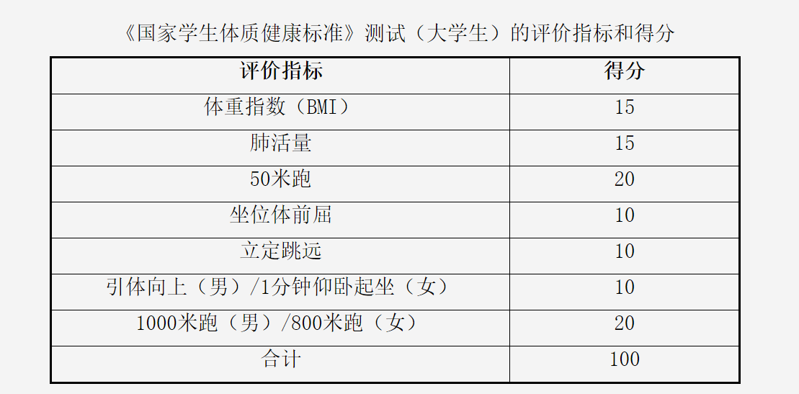
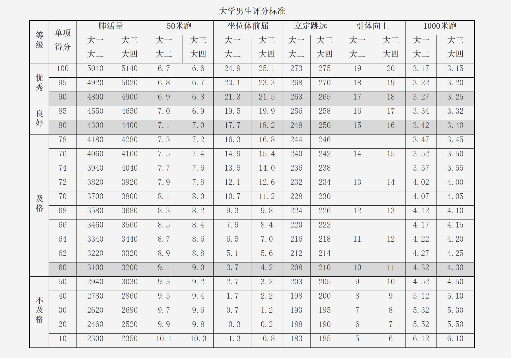
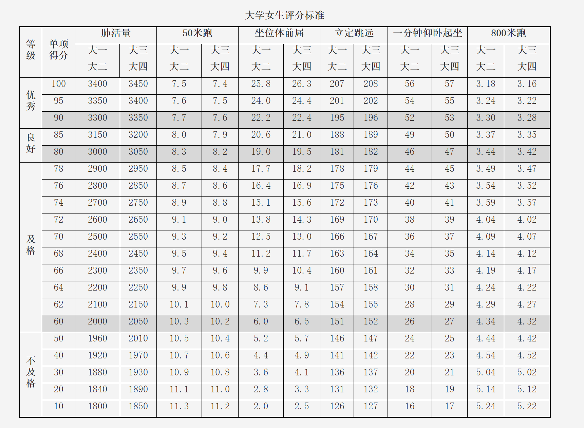
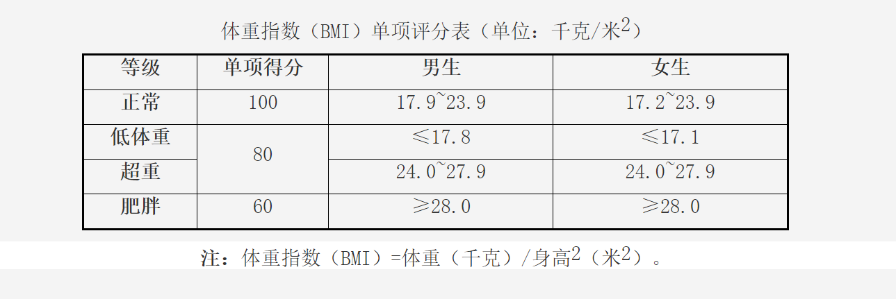

# 体测

秋季学期需参加教育部要求的体质测试。

除此之外，学校在秋季学期会有耐力专项（长跑，立定跳远），春季学期会有力量专项（引体向上，仰卧起坐，短跑）。

## 体质测试表

体质测试通常占总成绩的10%，只要各项加起来达到60分，即可获取这总评的10分

此测试标准全国统一

男生：

女生：

BMI:

## 长跑

|得分|3000m(男)|1500m(女)|
|:-:|:-:|:-:|
|20|12′20″|6′40″|
|19|12′30″|6′45″|
|18|12′40″|6′50″|
|17|13′00″|7′00″|
|16|13′20″|7′10″|
|15|13′40″|7′20″|
|14|14′00″|7′30″|
|13|14′20″|7′40″|
|12|14′40″|7′50″|
|11|15′00″|8′00″|
|10|15′20″|8′10″|
|9|15′40″|8′20″|
|8|16′00″|8′30″|
|7|16′20″|8′40″|
|6|16′40″|8′50″|
|5|17′00″|9′00″|
|4|17′20″|9′10″|
|3|17′40″|9′20″|
|2|18′00″|9′30″|
|1|18′20″|9′40″|

## 立定跳远

|得分|男|女|
|:-:|:-:|:-:|
|10|2.65|2.05|
|9|2.58|1.98|
|8|2.48|1.88|
|7|2.38|1.78|
|6|2.28|1.68|
|5|2.23|1.63|
|4|2.18|1.58|
|3|2.13|1.53|
|2|2.08|1.48|
|1|2.03|1.43|

## 力量专项

|得分|引体向上(男)|一分钟仰卧起坐(女)|50m(男)|50m(女)|
|:-:|:-:|:-:|:-:|:-:|
|20|21|50|6.3|7.5|
|19|20|49|6.4|7.6|
|18|19|47|6.6|7.7|
|17|18|45|6.8|7.8|
|16|17|43|7.0|8.0|
|15|16|41|7.2|8.2|
|14|15|39|7.4|8.4|
|13|14|37|7.6|8.6|
|12|13|35|7.8|8.8|
|11|12|33|7.9|8.9|
|10|11|31|8.0|9.0|
|9|10|30|8.1|9.1|
|8|9|29|8.2|9.2|
|7|8|28|8.3|9.3|
|6|7|27|8.4|9.4|
|5|6|26|8.5|9.5|
|4|5|25|8.6|9.6|
|3|4|24|8.7|9.7|
|2|3|23|8.8|9.8|
|1|2|22|8.9|9.9|

 

上次修改时间：2024-7-15
  
贡献者：自76张广昱