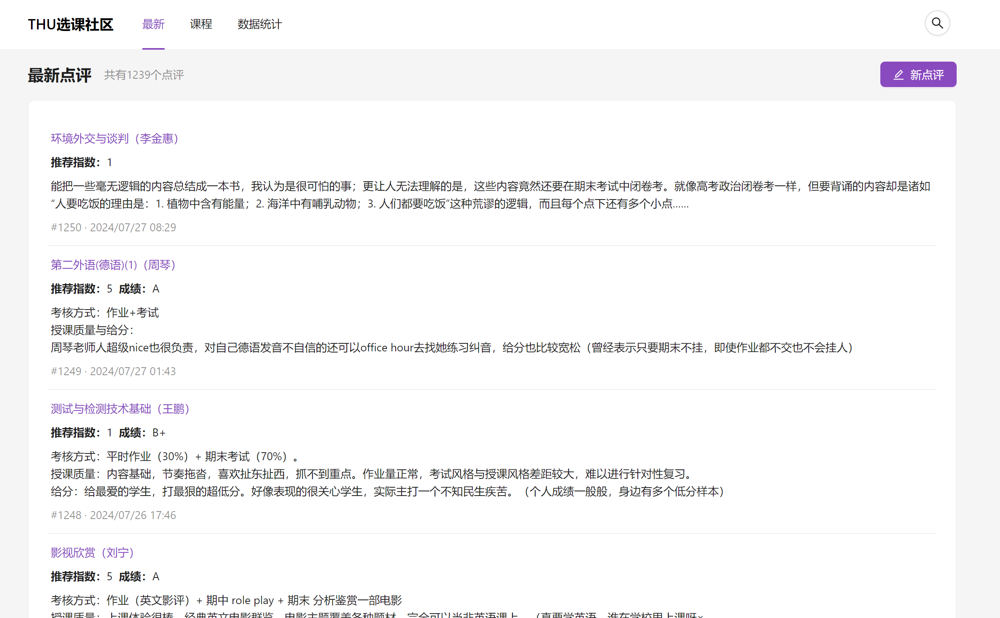
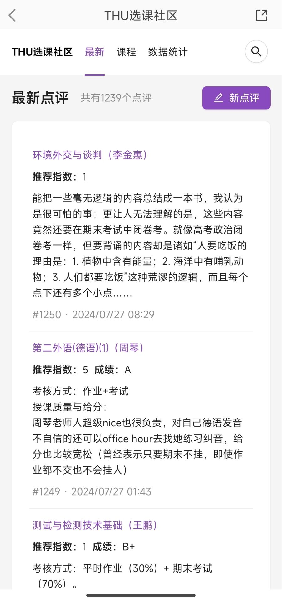
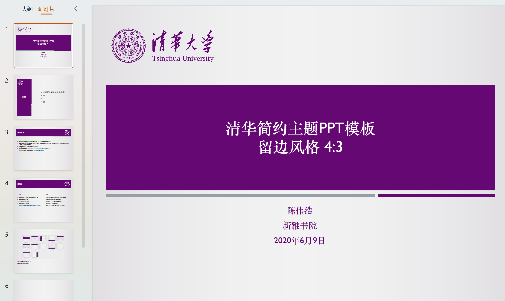
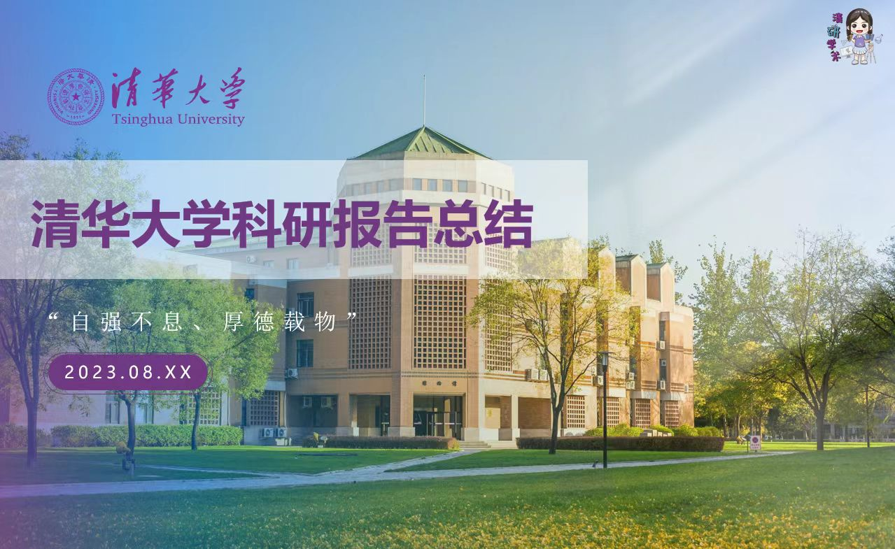
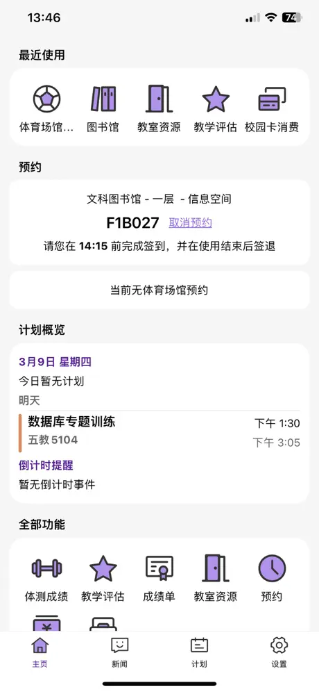
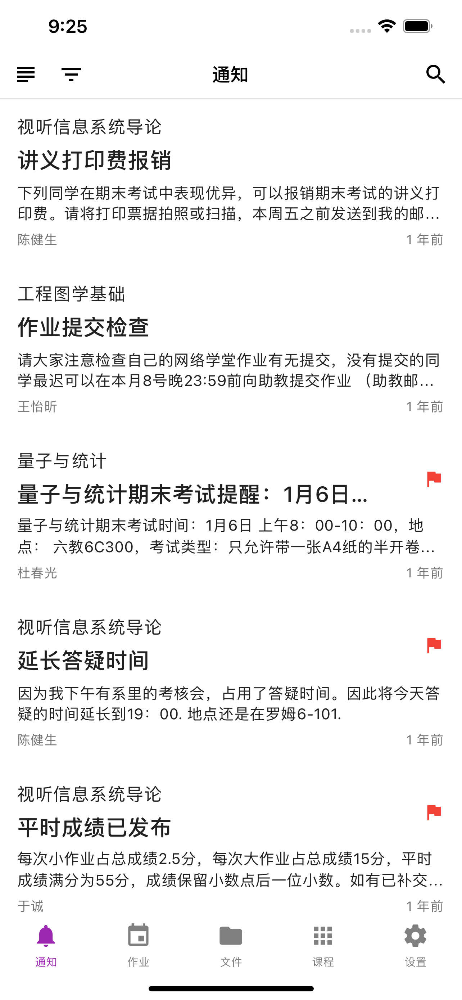
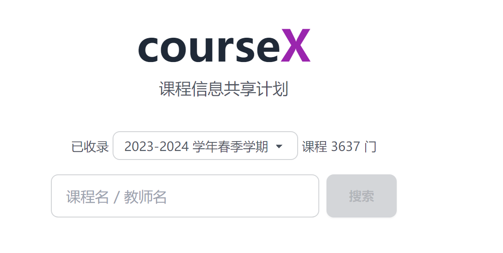

# 常用网站及App

## 官方

注意，以下部分网站需在内网环境下打开

### 最常访问

#### [info](http://info.tsinghua.edu.cn/)

网址：https://info.tsinghua.edu.cn/

涵盖从学校通知公告到个人学习生活的各种功能，也是通往校内各大分支网站的途径之一。登录后的界面功能更丰富，常用功能有选课、成绩查询、场馆预约等。

注意：部分浏览器可能对http://info.tsinghua.edu.cn/访问出错，请换成https前缀再试。

 

#### [教学门户](https://academic.tsinghua.edu.cn/)

网址：https://academic.tsinghua.edu.cn

涵盖所有与教育教学相关的内容，包括教务、课程、项目相关的操作和信息披露，关于辅修、课程替代的重要信息都可以在教学门户上查到。

 

#### [webvpn](https://webvpn.tsinghua.edu.cn/)

网址：https://webvpn.tsinghua.edu.cn/

校外访问内网环境时自动跳转的网址。登录后可无阻碍访问内网

 

#### [网络学堂](https://learn.tsinghua.edu.cn/)

网址：https://learn.tsinghua.edu.cn/

课程公告、文件、作业、讨论等和每学期课程息息相关的信息，公告和作业会关联企业微信提醒，注意查看。

 

 

### 图书馆相关

#### [官网](http://www.lib.tsinghua.edu.cn/)

网址：http://www.lib.tsinghua.edu.cn/

 

#### [水木搜索](https://discover.lib.tsinghua.edu.cn/)

网址：https://discover.lib.tsinghua.edu.cn/

用来搜索某本书在哪个图书馆的那个位置，是否被借阅等。

 

#### [座位情况查询](https://seat.lib.tsinghua.edu.cn/)

网址：https://seat.lib.tsinghua.edu.cn/

实时查看图书馆座位被预约情况

 

#### [教参服务平台](https://ereserves.lib.tsinghua.edu.cn/)

网址：https://ereserves.lib.tsinghua.edu.cn/

各种教材的电子版

 

 

### 生活服务相关

#### [学生清华](https://student.tsinghua.edu.cn/)

网址：https://student.tsinghua.edu.cn/

教室，场地预约，活动报备。

  

#### [清华家园网](http://myhome.tsinghua.edu.cn/)

网址：http://myhome.tsinghua.edu.cn/

宿舍保修，缴纳电费，部分教室和活动室预约

 

#### [1911星球](https://planet.tsinghua.edu.cn)

网址：https://planet.tsinghua.edu.cn

团委出品的校内短视频社区，站务会做一些校内信息通知

 

#### [后勤综合](https://pt.tsinghua.edu.cn/)

网址：https://pt.tsinghua.edu.cn/

报销，保修，电话查询，订餐等杂事

 

#### [体育馆预约](https://50.tsinghua.edu.cn/)

网址：https://50.tsinghua.edu.cn/

预约各种体育场馆，气膜馆，游泳馆等

 

### 信息服务

#### [校园公共软件its](http://its.tsinghua.edu.cn)

网址：http://its.tsinghua.edu.cn

提供一些学校购买的正版软件，如

* windows：win8、win8.1、win10、win11
* 杀毒软件： NOD32、卡巴斯基
* 开发软件： Visual Studio、 SqlServer
* 办公类：福昕PDF编辑器、WPS、Xmind、visio、 Office
* 科学计算类：Matlab、NAG、SPSS

  

#### [清华网盘](https://cloud.tsinghua.edu.cn/)

网址：https://cloud.tsinghua.edu.cn/

每人提供300G的免费存储空间

 

#### [清华邮箱](https://mails.tsinghua.edu.cn)

网址：https://mails.tsinghua.edu.cn

清华校园邮箱，可用来申请一些软件的教育版或学生身份认证。

注意：毕业后半年内清华邮箱会被回收失效，所以一些重要的账号绑定请慎用清华邮箱。

 

#### [各院系培养方案](https://www.tsinghua.edu.cn/jyjx/bksjy/bkzy.htm)

网址：https://www.tsinghua.edu.cn/jyjx/bksjy/bkzy.htm

## 非官方

注：非官方指由清华在校生or毕业生开发与维护

### [THU选课社区](https://yourschool.cc.cd/thucourse)

清华课程评测网站

网址：https://yourschool.cc.cd/thucourse

### [清华ppt模版-简约风](https://github.com/atomiechen/THU-PPT-Theme.git)

网址：https://github.com/atomiechen/THU-PPT-Theme.git

  

### [清华ppt模版-华丽风](https://cloud.tsinghua.edu.cn/d/25423ab283214a0a9ac8/)

由研究生会学术之路工作室定制的10套ppt模版。

网址：https://cloud.tsinghua.edu.cn/d/25423ab283214a0a9ac8/

注：清华ppt模版被很多无良营销号(如 某某助手，某某小助手，某某小喇叭，某某大喇叭，云上*友圈之流)拿去做转发推广引流，并在里面贴上了他们的营销二维码，请大家自觉抵制这种无良低劣账号，团体，平台。

  

### [thuinfo](https://github.com/thu-info-community/thu-info-app)

info的app版，封装了许多info的实用功能

  

### [learnx](https://github.com/robertying/learnX)

网络学堂的app版。

  

### [coursex](https://tsinghua.app/courses)

清华大学课程共享计划，可以用来查询某门课，某位老师的开课信息

  

### [毕业论文latex模版](https://github.com/tuna/thuthesis)

网址：<https://github.com/tuna/thuthesis>

  

### [毕业论文word模版](https://github.com/fatalerror-i/ThuWordThesis)

网址：<https://github.com/fatalerror-i/ThuWordThesis>

  

### [计算机系课程攻略](https://github.com/Salensoft/thu-cst-cracker )

网址：<https://github.com/Salensoft/thu-cst-cracker>

  

### [网络学堂下载器](https://github.com/liblaf/thu-learn-downloader)

网址：<https://github.com/liblaf/thu-learn-downloader>

  

### [华清大学课程攻略共享计划](https://in.closed.social:9443/pastExam)

收录部分往年试题和练习题

网址：<https://in.closed.social:9443/pastExam>

  

### [清华飞跃手册](https://feiyue.online/)

出国留学指南

网址：<https://feiyue.online/>

  

