# 教学楼

## 第一教学楼

位置：[二校门里西侧](https://www.amap.com/place/B000AA6Q33)

第一教室楼楼高三层。一楼两侧开设了大型阶梯教室各一间，除两个大阶梯教室外，还有五间教室可供同学们上课自习使用。

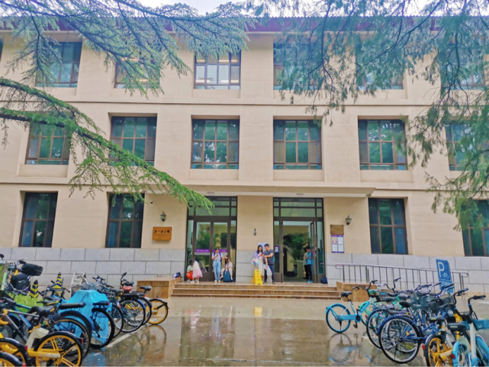

一教、二教是离学生公寓最远的教室楼，离二校门比较近。

## 第二教室楼

位置：[一教北侧、日晷西侧](https://www.amap.com/place/B000AB9AEF)

二教坐落于一教北侧，它内部设有三个宽敞的大教室和一个会议室。二教编号是从4开始，401，,402，等等。之所以这样命名是因为二教的命名延续一教的命名，一教命名到3楼。

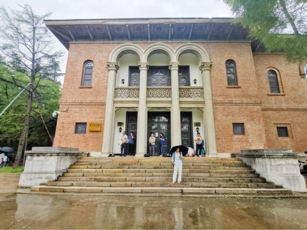

## 第三教室楼

位置：[学堂路东侧、南北主干道东侧、四教与六教中间](https://www.amap.com/place/B000AA0VLN)

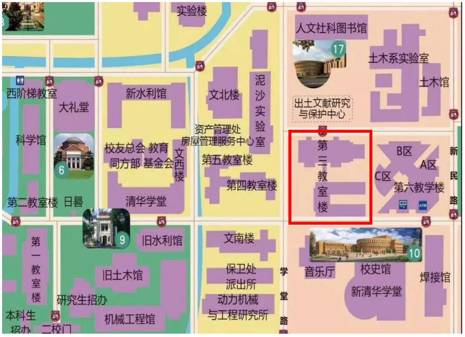

优雅设计的教室，充足采光的走廊，到处都是充满自由与多元的学习空间单元。全楼分为三段空间，从南到北依次是一段、二段、三段，每段都有独特的风格。

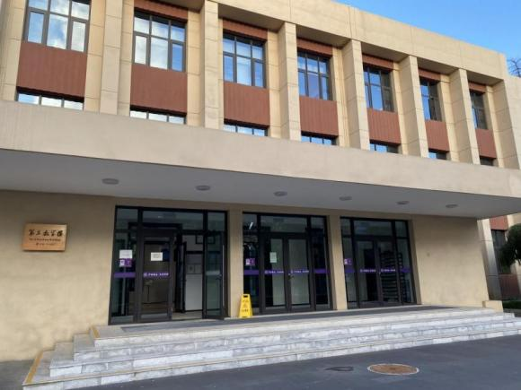

三教的教室编号也是根据段号来排列，例如三教1103：第一位数字表示段号，第二位表示楼层，后两位表示教室的顺序号。

## 第四教室楼

位置：[学堂路西侧](https://www.amap.com/place/B0FFFE5PEQ)

紧邻五教的是一个以“开放、多元、共享”为主要设计理念的网红教学楼——第四教室楼（简称四教）。

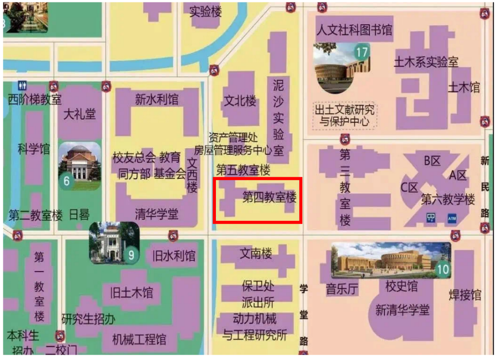

内部引入了开放式设计理念。楼内巧妙地通过楼梯连接各楼层，塑造出多层次、流动性的空间结构。重新装修开放的四教配备了投影仪、电脑、液晶显示屏、自动升降电脑桌、自动窗户等设备，还配备了阳台和研讨间供大家学习和休息。

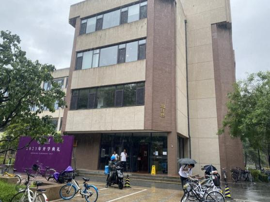

四教的教室编号也非常容易理解，和一教二教一样，只不过在最前面加了一个代表四教的4。如四教4204，第一位数字代表第四教室楼，第二位为楼层，后两位为教室的顺序号。

## 第五教室楼

位置：[学堂路西侧，紧邻四教](https://www.amap.com/place/B000ABCAJK)

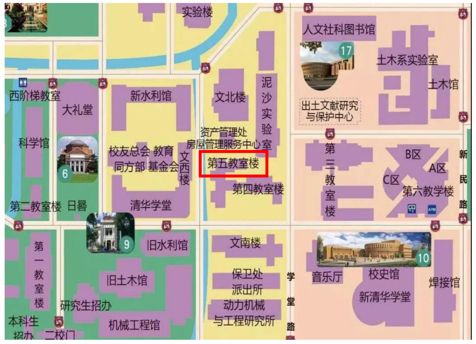

楼体为两层，外观设计采用红白两种色调，与周边的“清华学堂”等老教学区建筑和谐相融。墙面有着葱绿的爬山虎，为建筑增添了夏季的清凉感。

五教以两层为主，大胆地使用红白两种色调，取得了与西邻的“清华学堂”等老教学区的建筑造型和色调上的谐和，楼内均为公用教室。

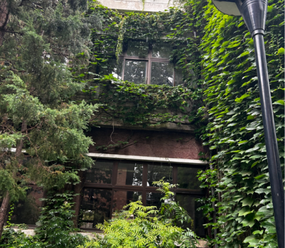

## 第六教学楼

位置：[三教东侧，新民路西侧](https://surl.amap.com/syQSqiEfgJd)

校内规模最大的第六教学楼（简称：六教），清华规模最宏大、设施最先进的教学大楼，共有A、B、C三栋大楼，各区之间有连廊链接。配置现代化教学设施，拥有高水平的多媒体电教及网络设备。

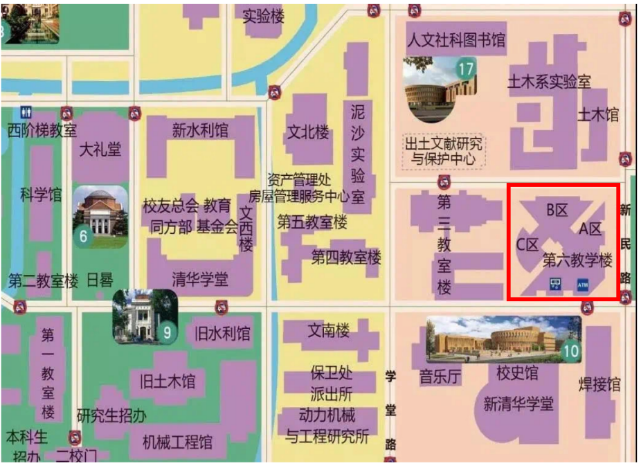

被划分为A、B、C三个区域，并通过连廊相互连接。内部设有公共教室103间，普通物理实验室42间。

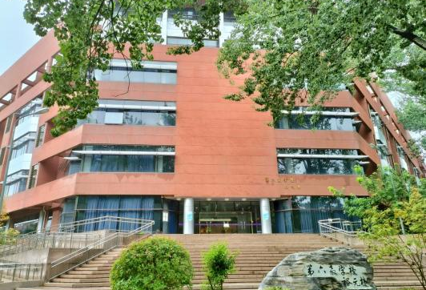

六教独特地将教学、科研和公共空间融合为一体

六教的教室编号需要结合区域来进行解读，例如：6A018、6B108、6C300等。其中，第一位数字代表第六教学楼，第二位代表区号，第三位表示楼层，后两位为教室的顺序号。

## 西阶梯教室

位置：[大礼堂前西侧](https://www.amap.com/place/B000AA7YZ9)

离开二教，北穿越科学馆，便能抵达西阶梯教室（简称西阶）。

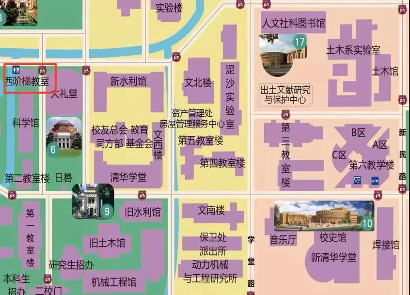

其内部设有一个阶梯教室，主要用于举办大型的汇报、讲座和合唱排练等活动，如果报名参与学校一年一度的“一二·九”合唱，那么你将有很大概率来西阶沉浸式感受合唱的魅力所在。

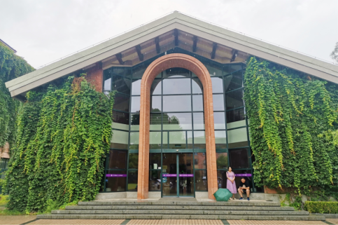

## 东阶梯教室

位置：[位于东主楼九区一楼，从东主楼九区后面进入即可](https://www.amap.com/place/B0FFG39KHH)

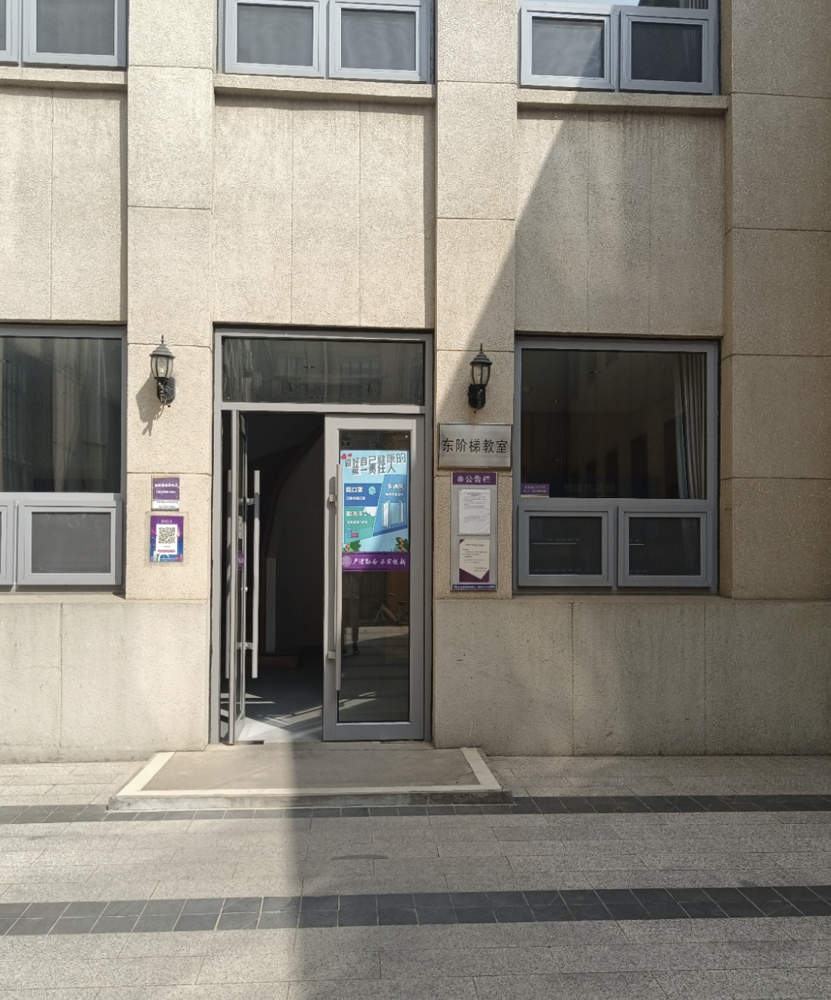

## 清华学堂

位置：[清华学堂](https://www.amap.com/place/B0FFGAN9IJ)

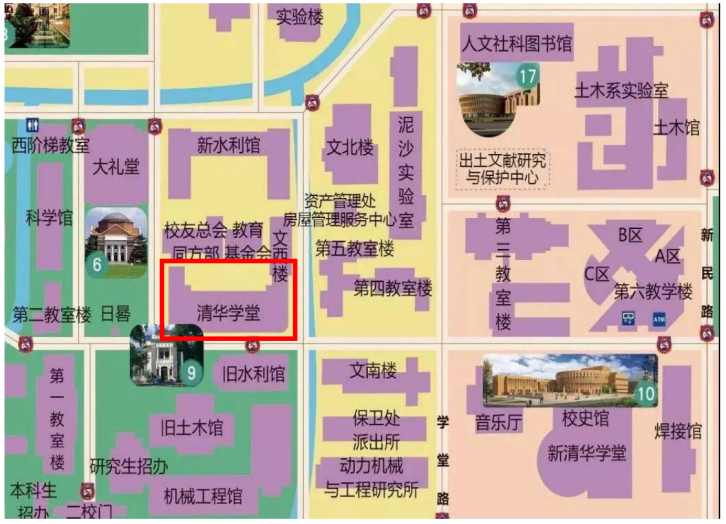

清华学堂是清华园内最早的建筑之一，这里学习氛围浓厚，清华学堂还有地下一层内有很多自习的地方，在那也有很多比较适合几个人一起开会的研讨间。

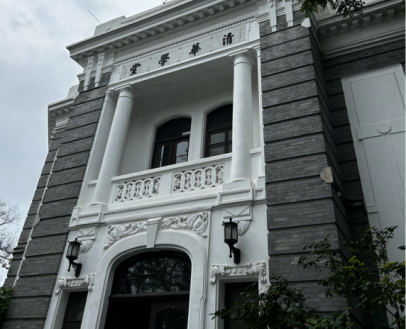

## 逸夫技术科学楼（技科楼）

位置：[位于建筑馆南侧](https://www.amap.com/place/B000A81F5C)

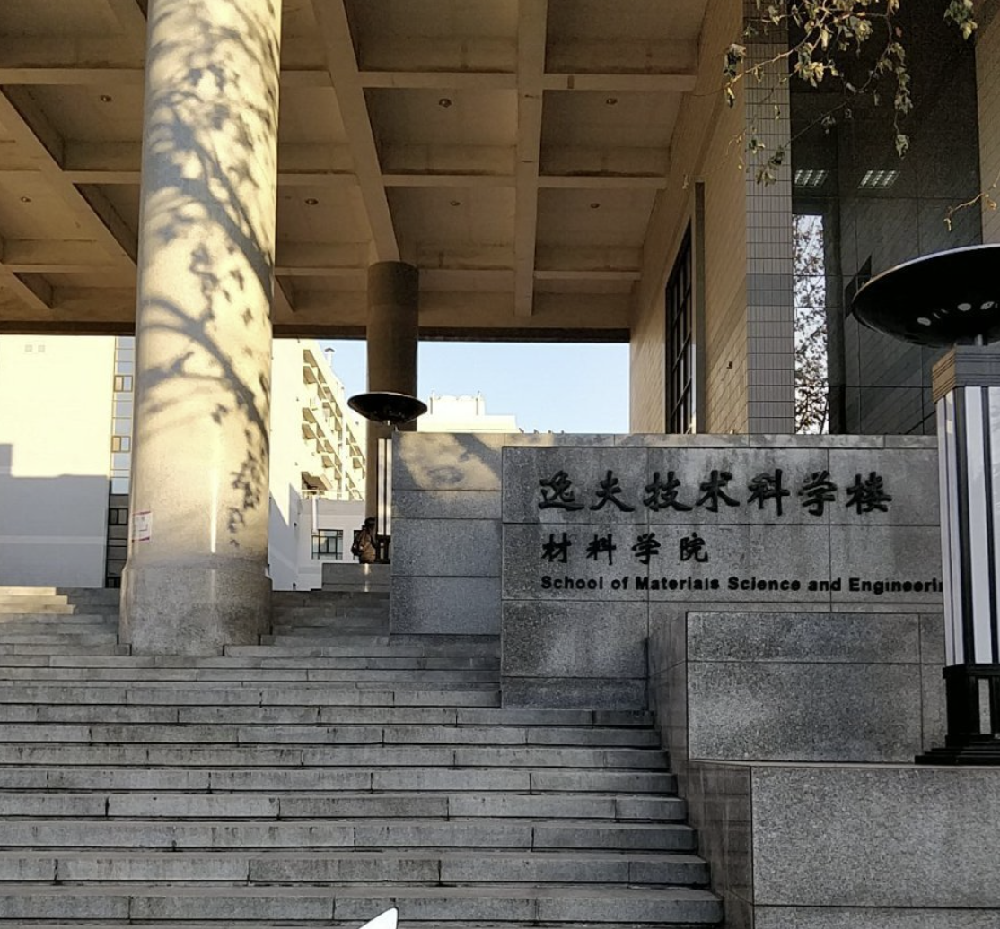

分为ABC三区。命名规则：第一位数字是段号，第二位是楼层，后两位是顺序号，如技科楼3217。

## 新水利馆（新水）

位置：[位于大礼堂东侧](https://www.amap.com/place/B0FFFEILL9)

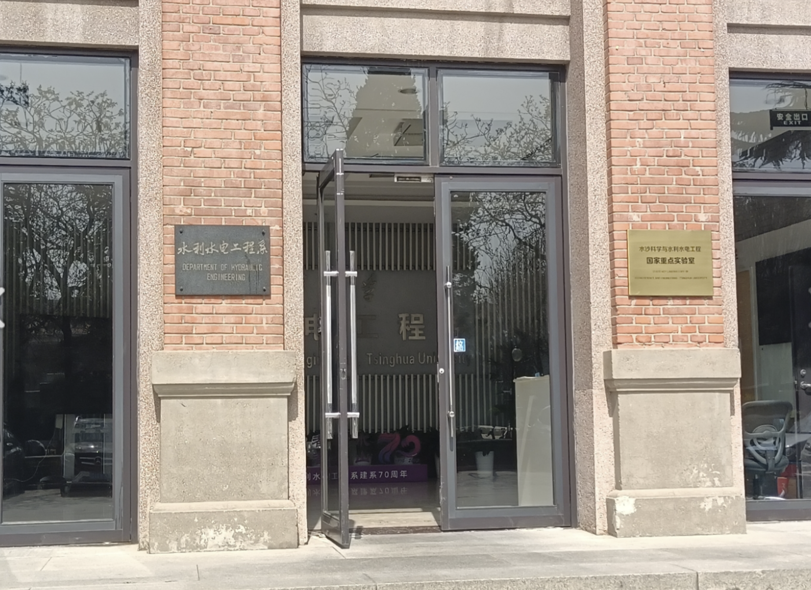

命名规则：第一位数字是楼层，后两位是顺序号，如新水301。

## 文北楼

位置：[新水利馆东侧](https://www.amap.com/place/B0FFFDWVNX)

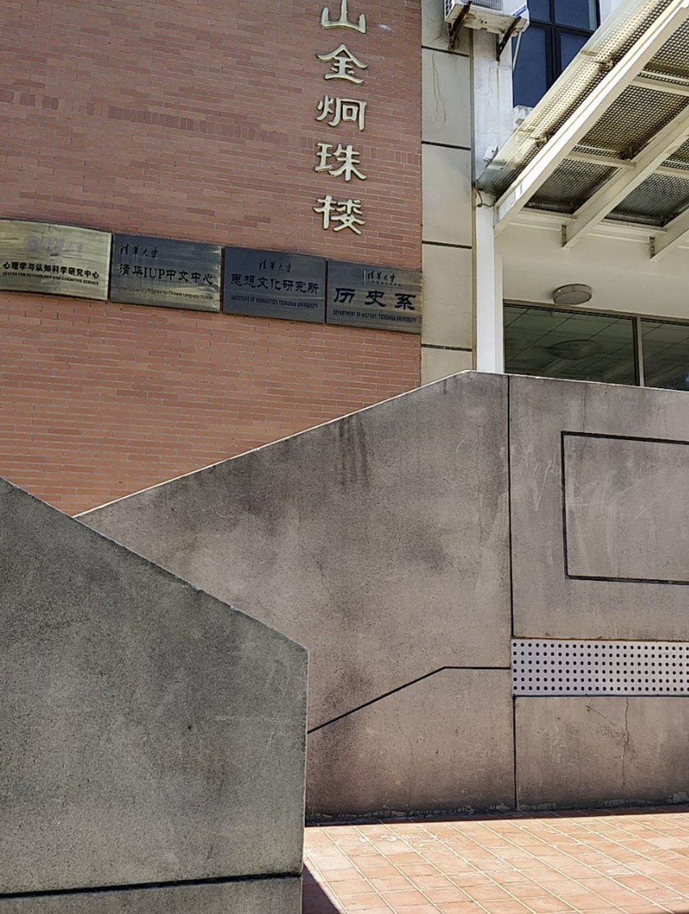

命名规则：第一位数字是楼层，后两位是顺序号，如文207。

## 伟伦楼

即新经管楼

位置：p中央主楼南侧，建筑馆西侧](https://www.amap.com/place/B000A7EJ3U)

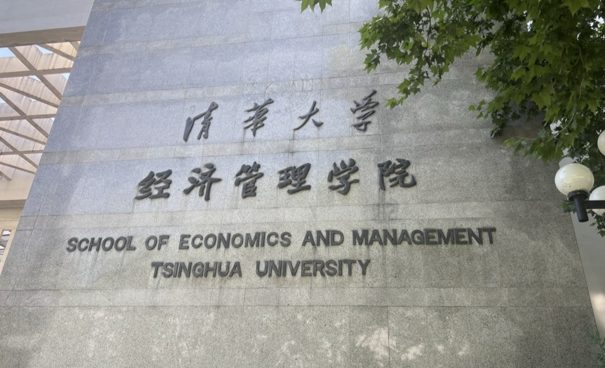

分为南楼、中楼、北楼。命名规则：第一位数字是楼层，后两位是顺序号，如新经管北405。

## 明理楼

即法学院大楼

位置：[主楼南侧、技科楼西侧、北邻经管学院伟伦楼](https://www.amap.com/place/B000AA0VLJ)

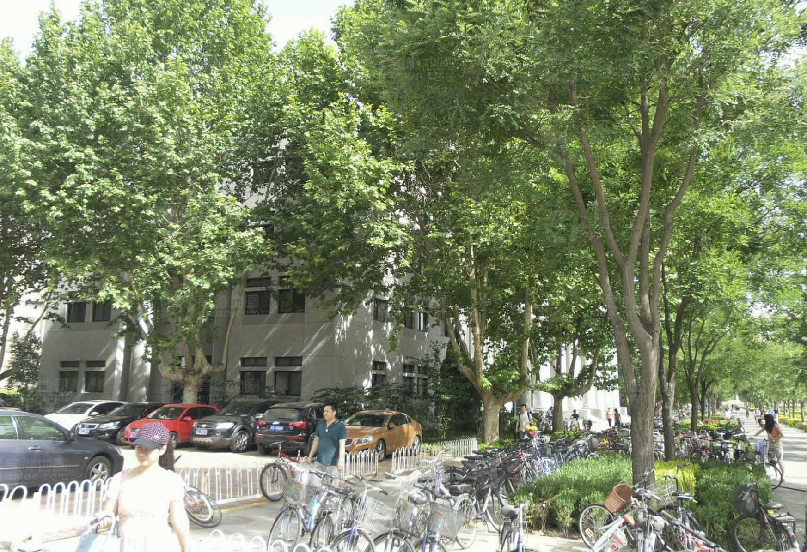

命名规则：第一位数字是楼层，后两位是顺序号，如明理楼11

 

上次修改时间：2024-6-13
  
贡献者：软3eric，计76林慎吾
