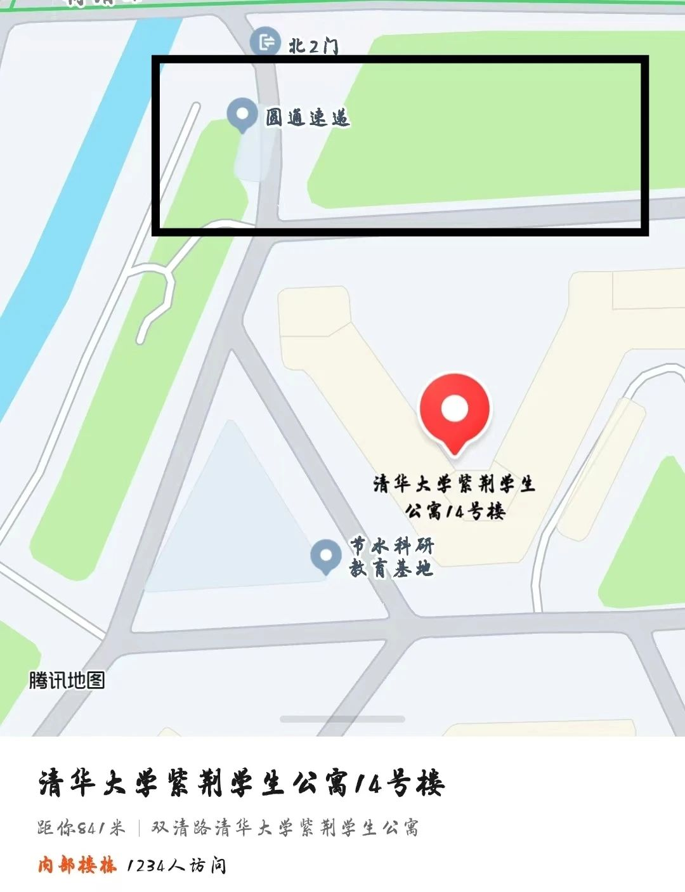
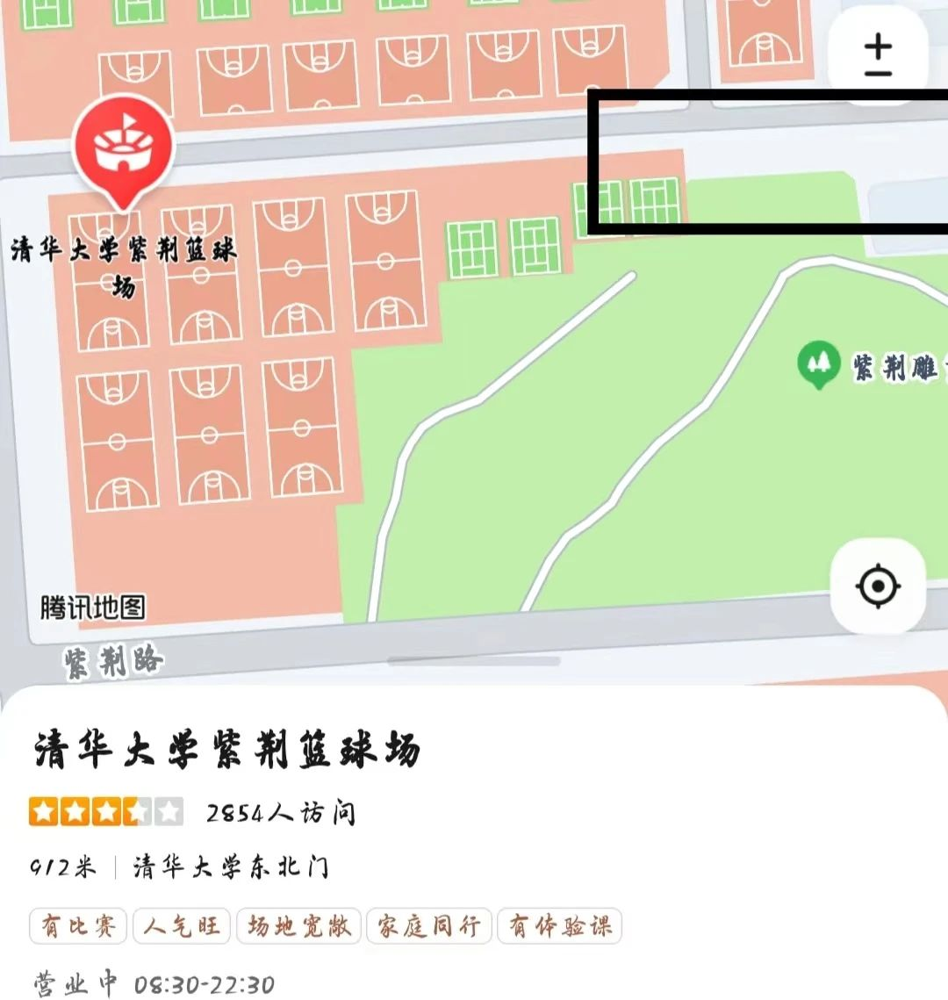
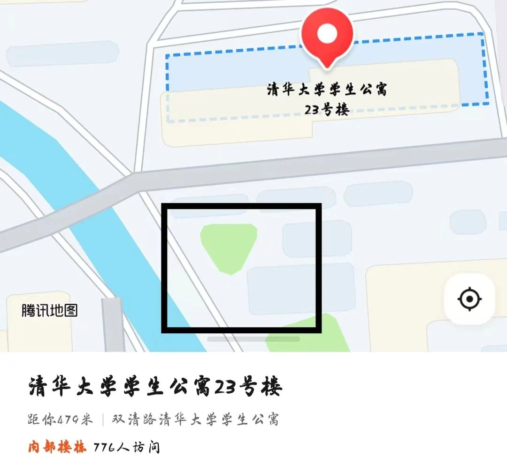
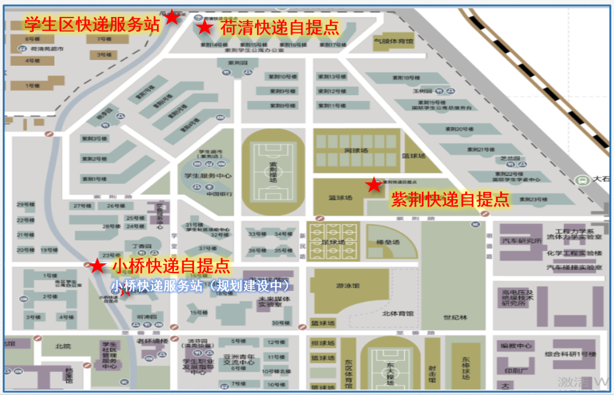

# 快递

## 大件物品采买与快递信息
*  快递收寄：南区宿舍楼地址填写“清华大学学生公寓xx楼”，紫荆公寓填写“清华大学紫荆公寓xx楼”
* 床垫购买：在注册家园网账号后，通过公众号新生通道了解宿舍情况和床铺尺寸。床垫可网购直接快递至学校，或在报到当天在校内天猫超市购买。
*  自行车与电瓶车购买：校园面积大，建议使用自行车或电瓶车代步。自行车推荐网购后在校内修车摊组装（约30元），也可在校内修车摊或校园周边自行车专卖店购买。电瓶车可在校外专卖店购买，但需自行解决充电问题。

## 三大快递点

### 紫荆14号楼北快递点

地点：[紫荆学生公寓14号楼北侧](https://www.amap.com/place/B0FFFEFJFH)

分为快递驿站和东侧（面对驿站右手边）小树林后的快递柜两部分，具体位置如下：

### 紫荆篮球场东快递点

地点：[紫荆篮球场东侧（紫荆操场背对C楼时面向的方向）](https://www.amap.com/place/B0FFFW4WTN)

只有快递柜，具体位置如下：

### 老23号楼南快递点（小桥快递点）

地点：[位学生公寓23号楼南侧](https://www.amap.com/place/B000A96G11)，丁香园食堂西侧（面向丁香园入口左手），远离学堂路方向的小桥东。听涛园食堂西侧（面向听涛园正门左手），路北走（面向听涛园正门左转不过桥，沿河边路右转即可）。此处仅有快递柜。具体位置如下：

## 快递与搬运信息

### 校外宿舍快递

* 直接送至楼下快递点，准确填写宿舍地址。
* 实验室在清华校内的同学可将快递地址填写为实验室楼宇，在西北门对面快递点收取。
* 寄出快递可通过菜鸟APP或顺丰速运微信小程序下单，填写寄出地址和取件时间后由快递员上门取件，也可前往紫荆14号楼北快递驿站寄出。

### 校内大件物品搬运

报到当天，校研会与研团组织免费三轮车和板车师傅帮忙搬运行李。日常搬运可在宿舍楼或快递驿站借小推车，或联系校内三轮车师傅付费转运。部分联系方式： 

| 电话号码        |         |
|----------------|----------------|
| 13261262851    | 13520134258    |
| 15201684339    | 13120292766    |
| 15901376106    | 15600553353    |
| 13240772588    | 13683365546    |
| 13718436439    |                |

经规范后的快递自提点与快递服务站的名称如下：紫荆快递自提点、荷清快递自提点、小桥快递自提点、学生区快递服务站、小桥快递服务站

 

上次修改时间：2024-6-1
  
贡献者：计76林慎吾
