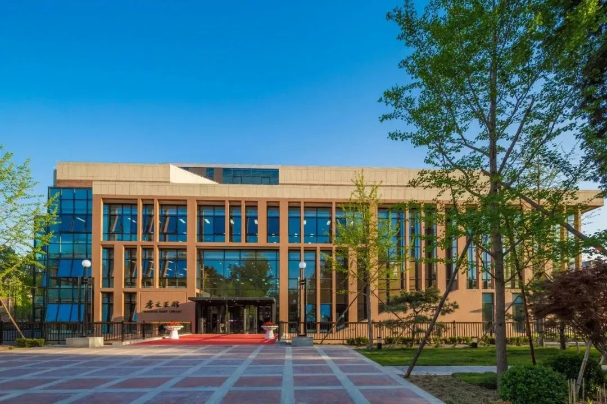
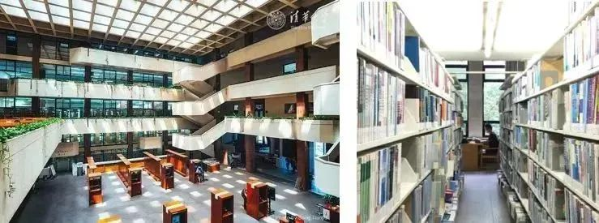
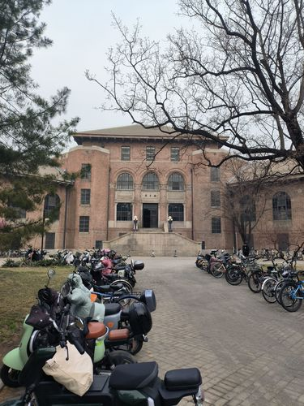
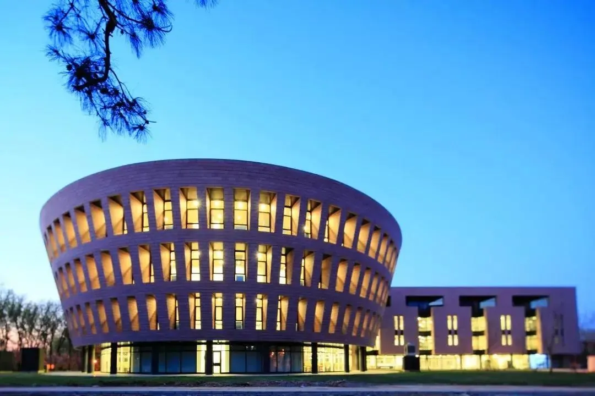
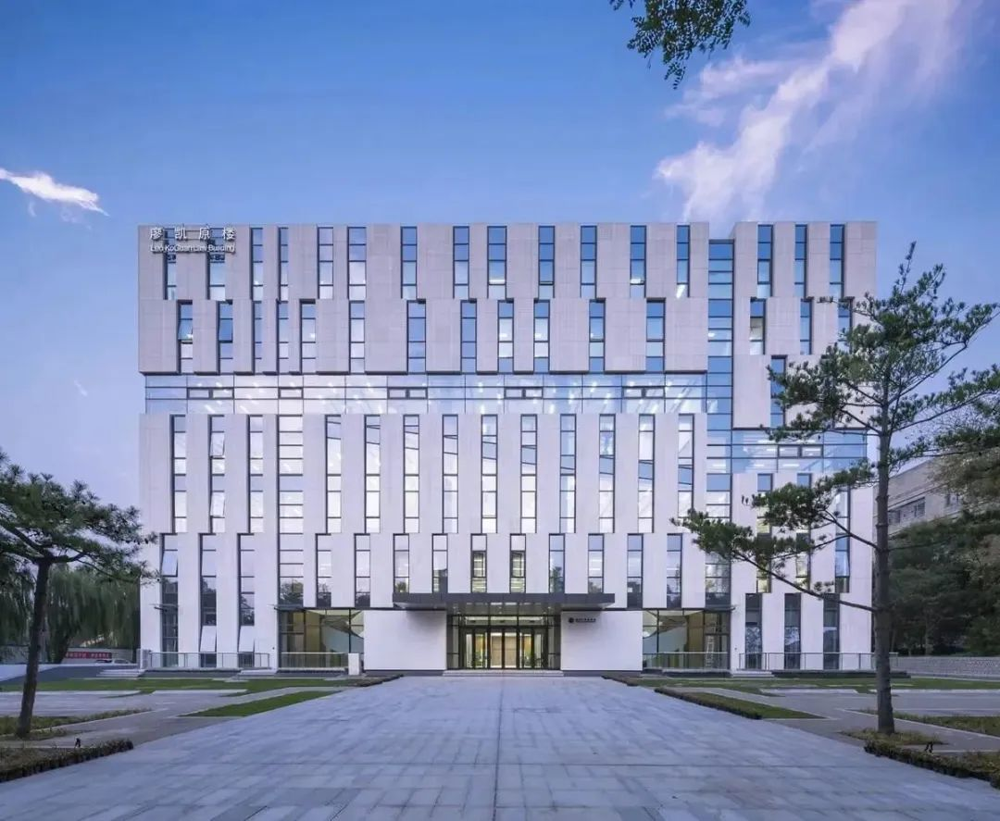
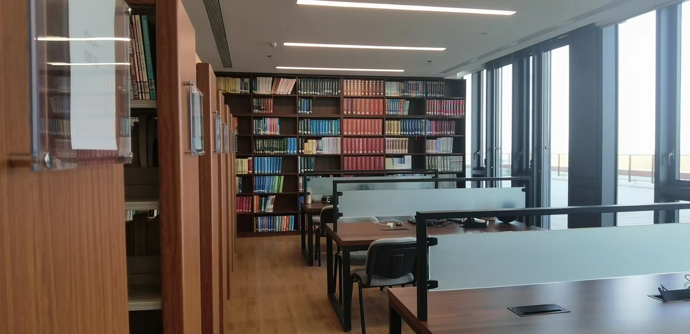
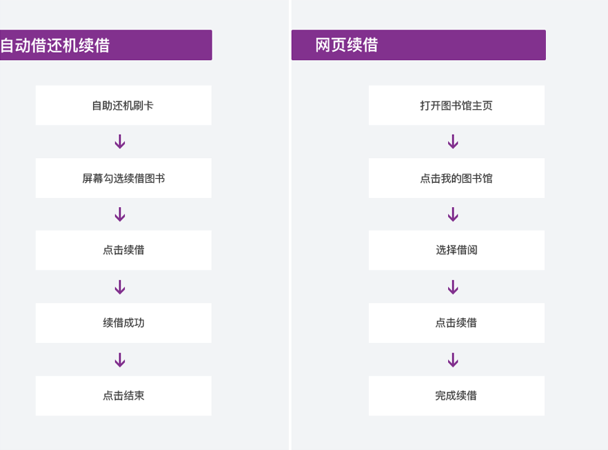

# 图书馆介绍

图书馆由图书馆总馆（老馆与西馆、北馆） ，文科、美术、金融、法律、经管、建筑等六个专业图书馆和若干院系资料室组成

## 北馆

全称：李文正馆

位置：[李文正馆位置](https://surl.amap.com/15dQ4SwZ2Sb)

介绍：由著名华人金融家、实业家、印尼力宝集团董事局主席李文正先生捐资建设，由中国工程院院士、著名建筑设计师、清华大学教授关肇邺先生领衔设计，于2016年年初落成。

功能：大量自习位置，长桌宽凳，环境舒适。各种中文社科类图书借阅。

## 西馆

全称：逸夫馆

位置：[逸夫馆位置](https://surl.amap.com/hXtA4kEZ9b5)

介绍：由清华校友、建筑学院教授关肇邺设计，于1991年9月建成。香港实业家邵逸夫先生捐资，国家教委拨款兴建，建筑面积约２万平方米。

功能：借阅各种理工科专业书籍，包括习题集等。

## 老馆

全称：老馆

位置：[老馆位置](https://surl.amap.com/icdVazSA3Qi)

介绍：1916年由美国建筑师亨利•墨菲设计，1919年春落成，建筑面积2114 平方米。一期建筑和大礼堂、科学馆、西体育馆并称**清华园早期“四大建筑”**。

功能：目前主要为自习室。周边环境不错。

## 文图

全称：人文社科图书馆

位置：[文图位置](https://surl.amap.com/ipiSChqyaci)

介绍：由瑞士著名建筑师马里奥·博塔和中国建筑科学研究院联合设计，于2011年4月百年校庆期间正式落成并投入运行

功能：自习室，独立小位置，私密性教好。借阅各种人文社科类书籍

## 法图

全称：清华大学法律图书馆

位置：[法图位置](https://surl.amap.com/iTyd3bOH4OT)

介绍：1999年12月，位于明理楼的法律图书馆正式启用，法律图书馆建筑面积为10,000平方米，包括二至五楼层的整体开放空间和闭架的地下书库。

功能：团建教室申请，自习。

## 经管图书馆

全称：清华大学经管图书馆

位置：[建华楼](https://surl.amap.com/dm13H6IbfrZ)

介绍：经管图书馆成立于 1985 年，主要为经管学院师生提供服务，同时也为清华大学其他院系读者提供服务。

## 图书馆预约规则

预约当日座位，须在预约成功后30分钟内完成签到

* 当日预约不可取消；

* 刷卡入馆前完成的预约，读者通过门禁闸机刷卡入馆自动完成签到；

* 刷卡入馆后完成的预约，系统自动完成签到；

* 如未在规定时间内签到，系统将记违规1次。

  

预约次日座位，须在预约生效日开馆后30分钟内签到

* 预约生效日开馆后，读者通过门禁闸机刷卡入馆自动完成签到；
* 如无法正常履约，应在预约系统开放期间登录取消预约；
* 预约生效日开馆前30分钟内无法取消；
* 如未在规定时间内签到，系统将记违规1次。

违规

违规累计满5次，暂停使用（含预约）座位权限3个自然日。

停用期结束后，违规计次归零，恢复选位和预约权限。

## 图书馆借阅规则

借阅数量

* 借书总量    100
* 预约总量    20

借阅期限

|图书类别|借期|续借|
|:-:|:-:|:-:|
|一般图书|8周|可续借3次，每次续借8周，最长允许224天。|
|短期图书|7天|可续借3次，每次续借1周，最长允许28天。|

续借流程

## 过期与赔偿

过期

|图书类型|金额|
|:-:|:-:|
|一般图书|0.2元/天|
|短期图书|10元/天|

丢失

[清华大学图书馆馆藏书刊遗失、损坏赔偿办法](https://lib.tsinghua.edu.cn/info/1115/2621.htm)

 

上次修改时间：2024-6-1
  
贡献者：自76张广昱

