# 咖啡馆与饮品店

## 清青咖啡

地点：观畴园南侧，社会科学学院北侧  
营业时间：10:30 - 21:00  
介绍：类似于西餐厅，有汉堡，咖啡，也有意面之类

## 独峰书院

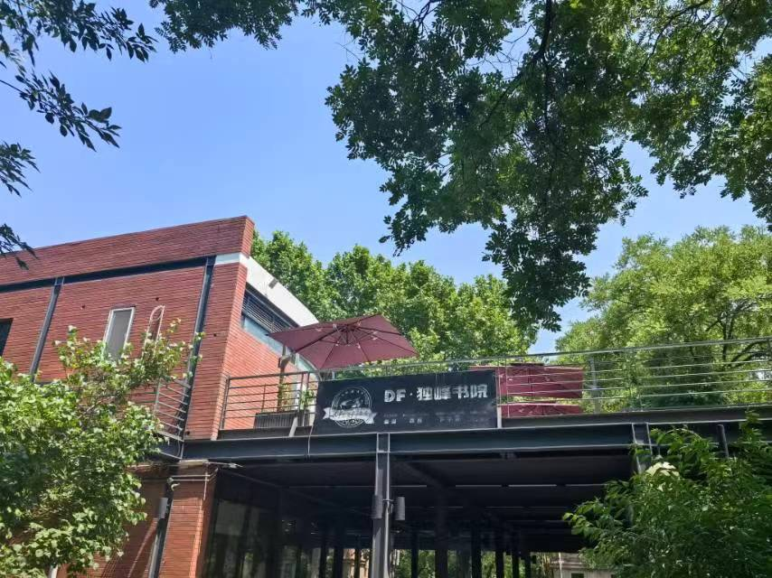

地点：清西文化长廊，观畴园向东步行1分钟  
营业时间：9:30 - 24:00  
介绍：顶流书院（雾）

## 紫荆书咖

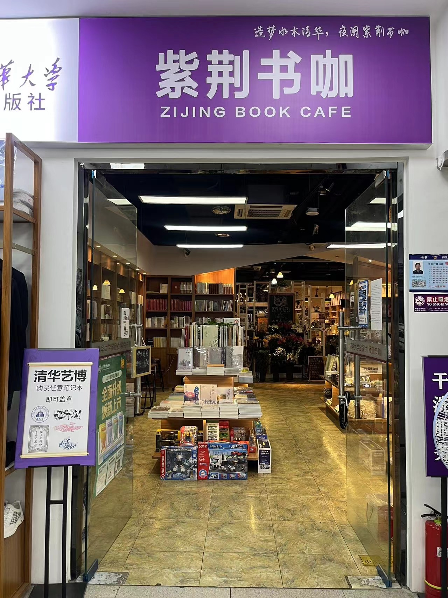

地点：观畴园地下一层，下楼右转即可见  
营业时间：9:00 - 次日2:00（节假日适当调整）  
介绍：咖啡饮品，图书文创

## 安家小厨

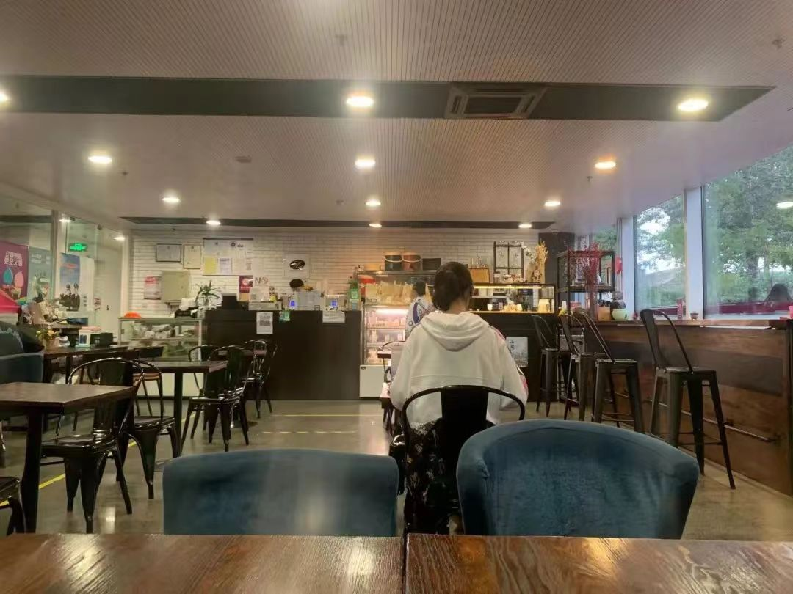

地点：文图正下方，座位有大约20个，每日面包在群中接龙  
营业时间：8:00 - 19:00  

介绍：面包不错

## 邺架轩

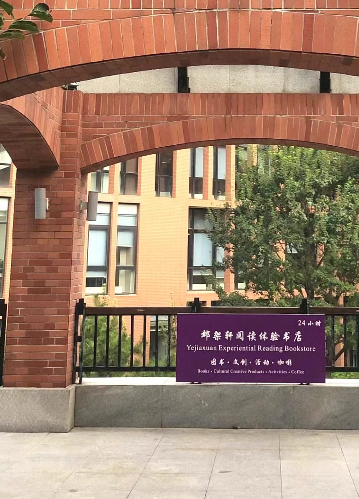

地点：北馆(李文正馆)下沉广场  
营业时间：24h营业  
介绍：刷夜首选地

## 拾年咖啡

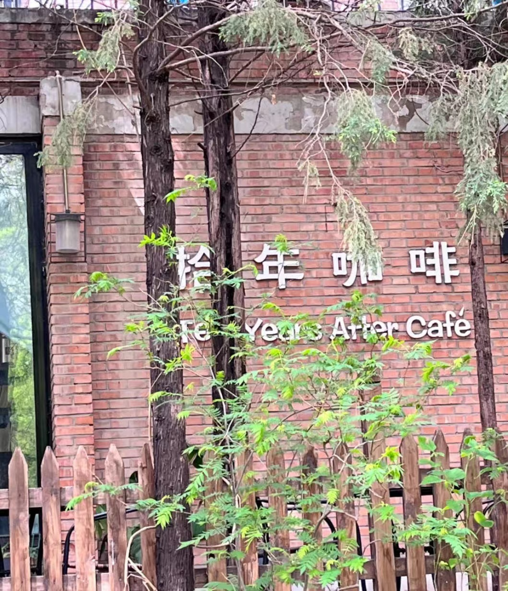

地点：学堂路与清华路的十字路口的西南边，在树林中  
营业时间：8:00 - 24:00  
介绍：咖啡，甜品

## 蒙楼咖啡

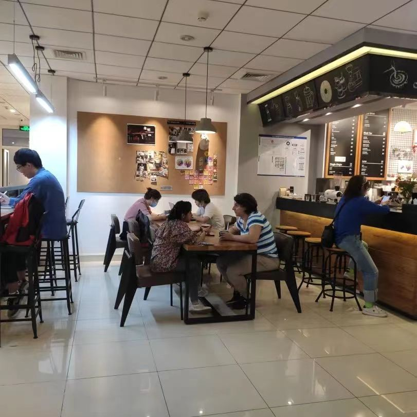

地点：西操旁蒙民伟楼内部，进门偏左直走可见  
营业时间：9:00 - 20:00  
介绍：咖啡和一些甜品

## 天投咖啡

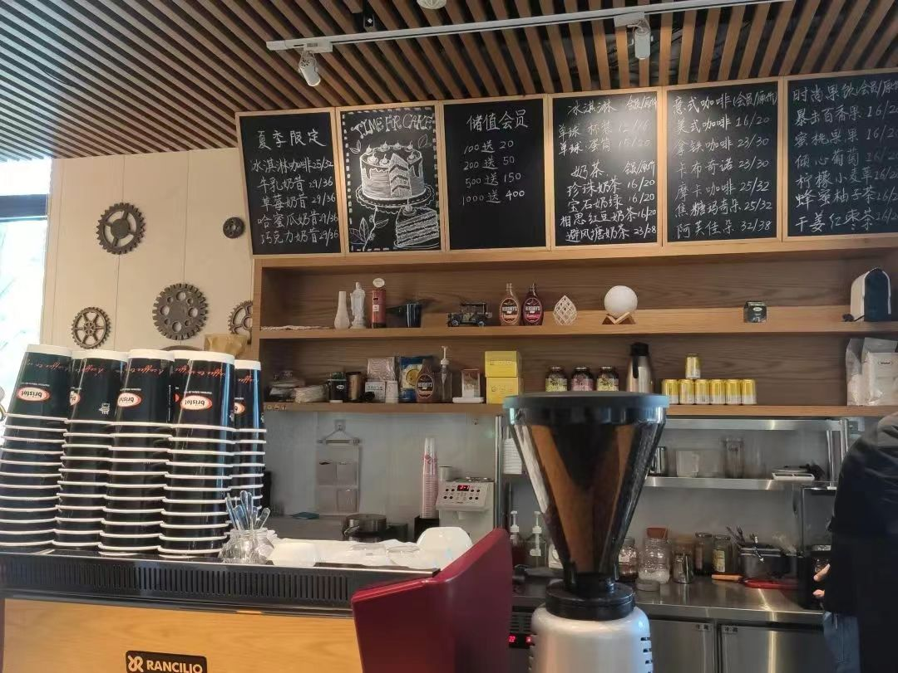

地点：李兆基科技大楼内部西北角，从大楼外部西北角可以看见名字，从西北侧“清华大学iCenter”处进门右转即可  
营业时间：7:30 - 20:30(工作日) 9:30 - 20:30（节假日）  
介绍：咖啡很正宗

## 麦隆咖啡

地点：环境节能楼内，从环境节能楼西侧旋转门处进入可以直接看到营业（座位属于系馆，有空位即可随时就坐）  
营业时间：7:30 - 19:00(工作日) 8:30 - 17:30（节假日）  
介绍：正常营业

## 泊星地咖啡

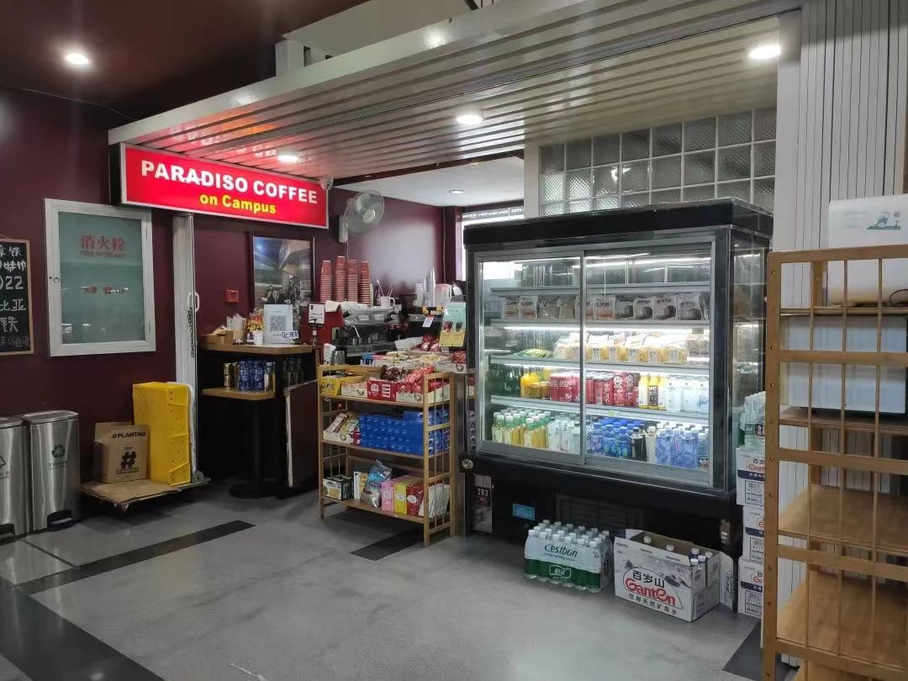

地点：经管学院伟伦楼，进门可见  
营业时间：7:00 - 19:00（工作日） 9:00 - 18:00（节假日）  
介绍：奶茶，果茶，咖啡，价格美丽

## 新咖啡

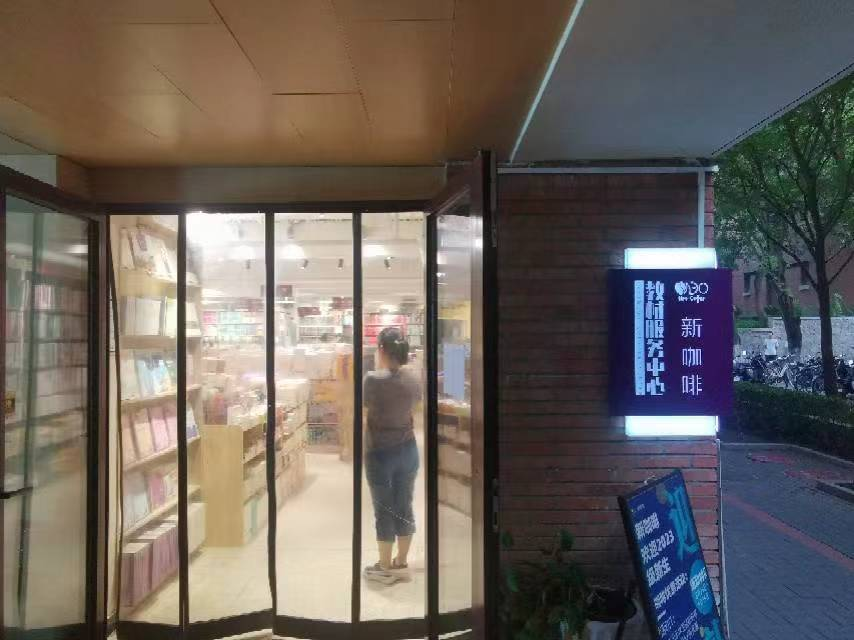

地点：南十楼下教材中心内  
营业时间：8:00 - 22:00  
介绍：咖啡，甜品，教材，文具

## 蒙楼咖啡(新清华学堂)

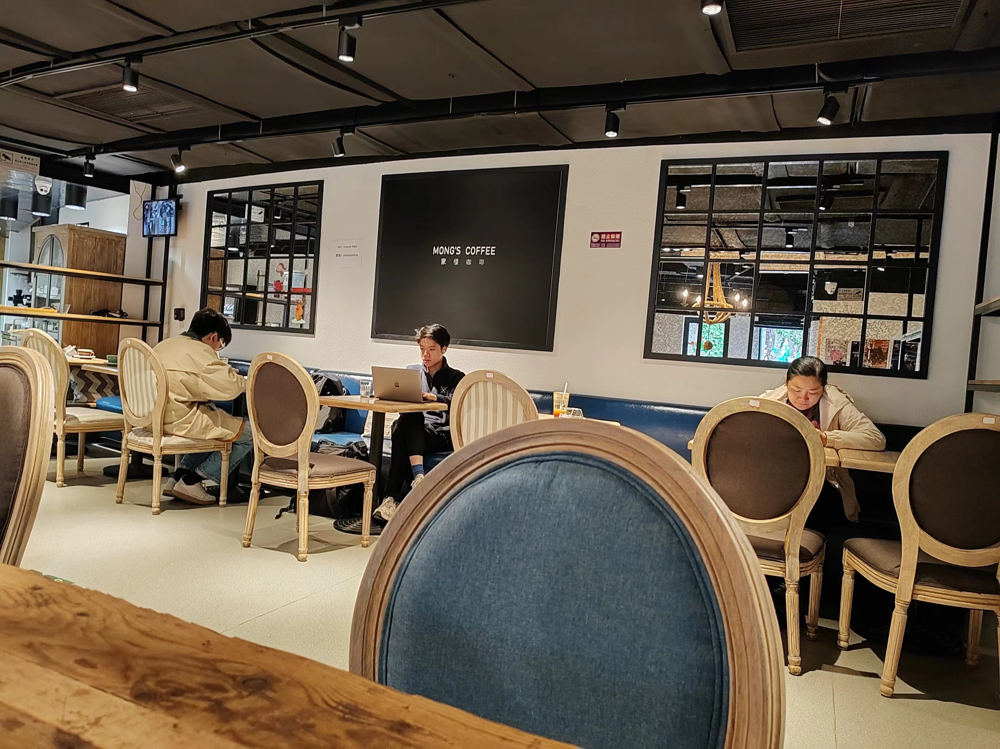

地点：新清华学堂负一楼下沉广场  
营业时间：9:00 - 20:00  
介绍：正常营业

## 1911咖啡

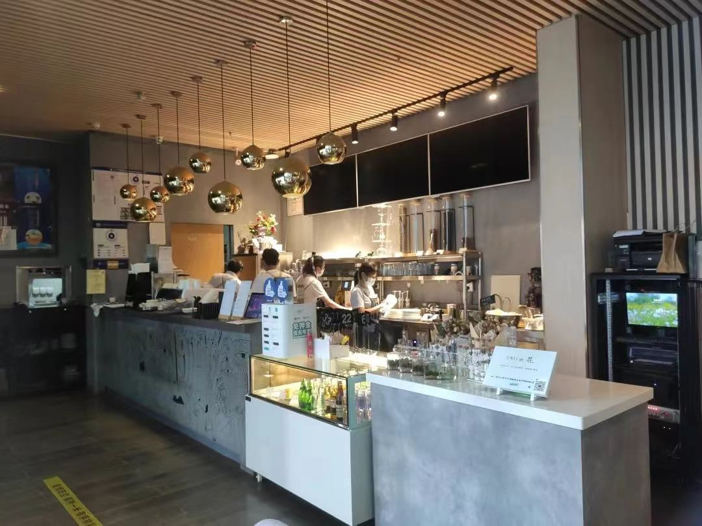

地点：艺术博物馆1楼  
营业时间：8:30 - 21:00  
介绍：正常营业

## 七港九

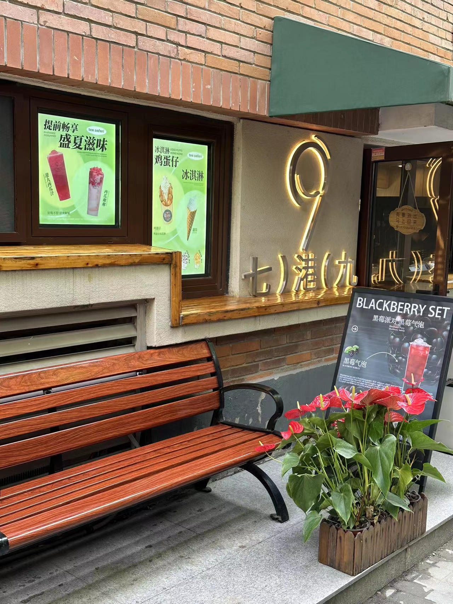

地点：南区7号楼楼下

营业时间：10:00 - 23:00

介绍：好喝的奶茶，水果茶

## 厝内小眷村

地点：C楼负一

营业时间：10:00 - 20:00

介绍：奶茶 

 

上次修改时间：2024-6-1
  
贡献者：计76林慎吾
